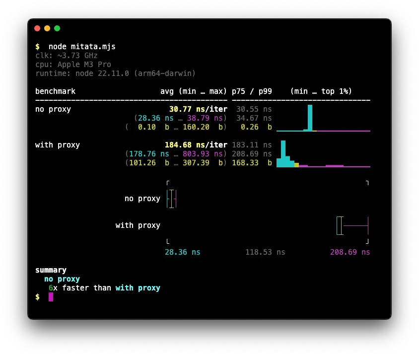

Photo by <a href="https://unsplash.com/@aminhasani?utm_content=creditCopyText&utm_medium=referral&utm_source=unsplash">Amin Hasani</a> on <a href="https://unsplash.com/photos/white-ceramic-mug-on-white-table-j16dLbiu8Kk?utm_content=creditCopyText&utm_medium=referral&utm_source=unsplash">Unsplash</a>

# Dealing with open database transactions in Prisma

There’s an issue that has been affecting one of the applications I maintain: runtime errors due to timed-out database transactions. The specific constraints that I was dealing with and the way I ended up resolving the issue were a bit interesting, so I felt like writing about it.

For context, this happened in a Node.js v22 application maintained by three fast-paced engineering teams, with a total of over a dozen contributors. We use Prisma v6 as our ORM against a MySQL database. However, everything I mention here is also applicable to Drizzle, another ORM for JavaScript and TypeScript applications.

## The error

The exact error I’m referring to is the one below:

```bash
PrismaClientKnownRequestError: Transaction API error: Transaction
already closed: A commit cannot be executed on an expired
transaction. The timeout for this transaction was 5000 ms, however
5012 ms passed since the start of the transaction. Consider
increasing the interactive transaction timeout or doing less work
in the transaction.
  code: 'P2028',
  clientVersion: '6.3.1',
  meta: {
    error: 'Transaction already closed: A commit cannot be executed
    on an expired transaction. The timeout for this transaction was
    5000 ms, however 5012 ms passed since the start of the
    transaction. Consider increasing the interactive transaction
    timeout or doing less work in the transaction.'
  }
```

The error message is self-explanatory but it’s also misleading at the same time. You’ll indeed see this if you open a transaction with Prisma and don’t finish it or close it before the timeout interval, but what it doesn’t say is that open transactions can get stuck and never be closed by Prisma itself when certain conditions are met.

This can be minimally reproduced with the code snippet below:

```tsx
const prisma = new PrismaClient()

await prisma.$transaction(async (tx) => {
  await tx.entity.update(/*...*/)
  await prisma.entity.update(/*...*/)
})
```

What’s happening here is that on the first `update` call, Prisma will open a transaction that is supposed to be committed when you exit the scope of the current callback. However, if you do another database write using the Prisma client instead of the available transaction before that exit, Prisma will never commit that open transaction and you end up getting the thrown exception above.

I can’t think of legitimate use cases for the code snippet above. Doing database mutations that way is almost certainly a mistake by the developer, not an intentional choice.

In a sense, we can say this is a bug in Prisma. I would not expect this code snippet to work as expected but at the very least, I feel that it could be handled slightly better by the ORM and provide a more useful error message that is less of a red herring.

The intended use of this API by the Prisma team is that you always use the transaction client inside the scope of an open transaction, but sadly, the design of the API does not help the consumer avoid this potential issue.

One additional hurdle here is that `$transaction` has an overload that takes in an array of queries instead of a callback like the example above, and you can also run into the same error in situations where you mix both APIs.

## Our problem

This misuse is exactly what was happening to us.

We were aware of what caused the error and why, but we have a very large and complex code base with long function calls. To orchestrate database operations that happen in multiple modules, we pass the transaction client as an argument to functions through many levels. When endpoints get too big, this passing of arguments becomes an issue very similar to the [“prop drilling”](https://react.dev/learn/passing-data-deeply-with-context) problem you get in React apps.

This becomes more than just annoying when those functions are re-used in different contexts where a transaction is not always needed, so that argument is then marked as optional by the developer working on a new feature.

Our initial approach was to remove all optional transaction client arguments and make them all required instead. This worked well in a few places but we quickly realized that it did not scale well with the size of our code base and we had way too many instances of this issue that would’ve required too many risky changes to make safely, not to mention it would’ve taken us a long time to complete.

Our second approach was to try to track with logs whenever we accessed the Prisma client instead of the transaction client when a transaction was active so that we would surgically fix those few instances instead of doing a big massive re-write.

That second approach would’ve fixed our existing offending call-sites but it did nothing to prevent this from happening again in the future without a change in technical direction in how we dealt with transactions, so it didn’t sit too well with me.

## The solution

I was looking for a solution that:

1. Was minimal and did not require a massive refactor
2. Fixed the existing offending issues
3. Prevented the issue from happening again in the future altogether

What I realized was that I had already implemented a context-tracking functionality in our app a long time ago based on [`AsyncLocalStorage`](https://nodejs.org/api/async_context.html), to store data like trace ids and user ids throughout the lifetime of a request. We had been battle-testing it for a long time already so I am 100% confident that it works everywhere, especially after we squashed a few edge cases like [this one](https://github.com/expressjs/multer/issues/814).

Our code base is private, but I extracted that bit to an OSS package, so you can view those sources here if you’re curious: [https://github.com/reyronald/async-local-storage](https://github.com/reyronald/async-local-storage#readme). We don’t use that package in our app but its implementation is very similar.

My solution consists of storing the active transaction in that asynchronous context, and instead of accessing the Prisma client, access the transaction client if available anytime a database query is attempted.

We also had OpenTelemetry already, which provides a context concept that’s internally built on top of AsyncLocalStorage. I could’ve used that instead if we didn’t already have our own.

To be able to do this though, I needed to be able to control all access to those clients. We had something in place already for this but it wasn’t used everywhere. Thankfully the changes required to address that were small and I was okay with pursuing that.

In essence, we wanted to go from:

```tsx
// db.ts
export const prisma = new PrismaClient()

// another-file.ts
import { prisma } from "@/db"

await prisma.entity.update()

await prisma.$transaction(async (tx) => {
  /*...*/
})
```

To this:

```tsx
// db.ts
const _prisma = new PrismaClient()

export const getDbInstance = () => _prisma

export async function runInDbTransaction<T>(
  fn: (tx: TransactionClient) => Promise<T>,
) {
  // ...
}

// another-file.ts
import { getDbInstance, runInDbTransaction } from "@/db"

const db = getDbInstance()

await db.entity.update()

await runInDbTransaction(async (tx) => {
  /*...*/
})
```

This also has the additional benefit that it completely prevents the usage of the second overload of `$transaction` which is another surface area that can trigger the error.

With this in place, I can now leverage our asynchronous context to implement the solution. First, I make sure to store the active transaction in the store:

```tsx
import { ctx } from "./asyncContext"

export async function runInDbTransaction<T>(
  fn: (tx: TransactionClient) => Promise<T>,
) {
  const prevTx = ctx.tx
  try {
    const result = await prisma.$transaction(async (tx) => {
      ctx.tx = tx
      const result = await fn(tx)
      return result
    })
    return result
  } finally {
    ctx.tx = prevTx
  }
}
```

Now, the magic. We have to make sure whenever `prisma` from `getDbInstance()` is used anywhere, we use `tx` instead if it exists in the context.

```tsx
export function getDbInstance(): TransactionClient {
  return new Proxy(_prisma, {
    get(target, prop: keyof typeof _prisma, receiver) {
      const realTarget = ctx.tx || target
      return Reflect.get<typeof realTarget, keyof typeof realTarget>(
        realTarget,
        prop,
        receiver,
      )
    },
  })
}
```

A Proxy is a great feature of the language that allows us to intercept reads on objects. We can use it to wrap it around the return value of our utility and do our checks there.

This minimal change immediately addresses and fixes any existing instance of the problem in the entire code base and makes it impossible for a consumer to accidentally get into this situation again. It also allows us to remove transaction clients from arguments everywhere as we were doing before, reducing the complexity of the signature of our functions.

Something else that's really nice is that it mimics the semantics of transactions in SQL itself. In SQL, a transaction is started simply by executing the `BEGIN` statement. After that, any and all subsequent statements will happen inside that transaction scope until a `COMMIT` or `ROLLBACK` statement is found. There's no need to specify any form of transaction identifier in future statements, and there's no additional reference to the open transaction either.

In my solution, calling `runInDbTransaction` represents that `BEGIN` statement, and closing the scope of its callback argument represents the `COMMIT` phase to end the transaction.

Although I understand Prisma's decision for its current transaction API, I feel we would be better off with an API that more closely resembles how it works in SQL.

I also maintain codebases in Go where we use GORM. They have an API that is exactly the same as Prisma's and Drizzle's callback version, but on top of that, they also offer a [manual transaction control option](https://gorm.io/docs/transactions.html#Control-the-transaction-manually). Take a look:

```go
// begin a transaction
tx := db.Begin()

// do some database operations in the transaction (use 'tx' from this point, not 'db')
tx.Create(...)

// ...

// rollback the transaction in case of error
tx.Rollback()

// Or commit the transaction
tx.Commit()
```

This makes more sense to me, especially after our experience with this issue. An API like this could be replicated in user-land using context and proxies, just like I did above.

The callback API feels like too much of a foot-gun. You only run into issues if you use it wrong, in an unintended way, but the fact that a wrong way to use it exists at all is a design flaw, in my opinion. Either way, offering options is the way to go, so kudos to the GORM team here.

### Performance

A common concern and criticism that you see related to the usage of proxies is that they have an impact on performance. This impact comes from the additional overhead associated with the fact that each property access has to go through the Proxy handler.

To understand how much of an impact we’re talking about, I ran a local benchmark test with `mitata`. This is what I got.

```tsx
import { PrismaClient } from "@prisma/client"
import { run, bench, boxplot, summary, do_not_optimize } from "mitata"

const prisma = new PrismaClient()

const getDbInstance = () => {
  return prisma
}

const getDbInstanceWithProxy = () => {
  return new Proxy(prisma, {
    get(target, prop, receiver) {
      return Reflect.get(target, prop, receiver)
    },
  })
}

boxplot(() => {
  summary(() => {
    bench("no proxy", function () {
      do_not_optimize(getDbInstance().user)
    })

    bench("with proxy", function () {
      do_not_optimize(getDbInstanceWithProxy().user)
    })
  })
})

await run()
```



This shows that wrapping the client with a proxy slows down access by a factor of 6. I also ran tests where the proxied client was cached instead of re-wrapped on every iteration of the benchmark, and the result was the same, which means that the instantiation of the proxy doesn’t have a measurable impact.

This might seem concerning but if we look at the durations, we’re talking about a difference of 31 nanoseconds, versus 185 nanoseconds. For context, there are 1,000,000 nanoseconds in a millisecond. It would take roughly 6,500 property access calls before this adds 1ms to the duration of the request.

In our application, we only access the database client a handful of times per request, so this is certainly insignificant for us.

It’s safe to say that this won’t be an issue for most apps. If someone has a use case where a couple of hundred nanoseconds makes a difference, they probably shouldn’t be using Node.js or Prisma to begin with.

## What about Drizzle?

Drizzle is a competing option to Prisma in the ORM space for JS and TS runtimes. It’s a bit younger but preferred by many not only because of the similarity of its API to raw SQL, but also because it is said to be more performant and provides a few features that Prisma doesn’t have. For example, it supports transaction save points, which are not available at the time of this writing in Prisma v6.

I wanted to see how Drizzle would handle this same scenario. Turns out that it behaves almost the same, and you do get a similar runtime error thrown. See below.

```jsx
Error: Lock wait timeout exceeded; try restarting transaction
    at PromisePool.query (...)
    at MySql2PreparedQuery.execute (...)
    at QueryPromise.execute (...)
    at QueryPromise.then (...)
    at process.processTicksAndRejections (node:internal/process/task_queues:105:5) {
  code: 'ER_LOCK_WAIT_TIMEOUT',
  errno: 1205,
  sql: '...',
  sqlState: 'HY000',
  sqlMessage: 'Lock wait timeout exceeded; try restarting transaction'
}
```

There’s one big difference though. The delay is much longer, 50 seconds to be exact, before the transaction times out and throws. This timeout is not configurable with Drizzle.

This experience is much worse compared to that in Prisma which has a default timeout of 5 seconds that can be changed per transaction. Imagine introducing this bug by accident on production and your users have to wait 50 seconds before they get a failed response from the server! The longer timeout also makes it more difficult to troubleshoot and fix. So I’ll have to give Prisma the win on this one.

## Conclusion

This solution has been in production for a while. I tested it across instances of previous incidents we had already fixed manually before. The results are as expected and no issues have been found.

Develoepr experience has also improved dramatically for implementation of new features now that our engineers don't have to worry about transaction management, argument drilling and making sure they're using the correct client. Personally I feel the release of this cognitive burden makes me more relaxed.
